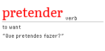
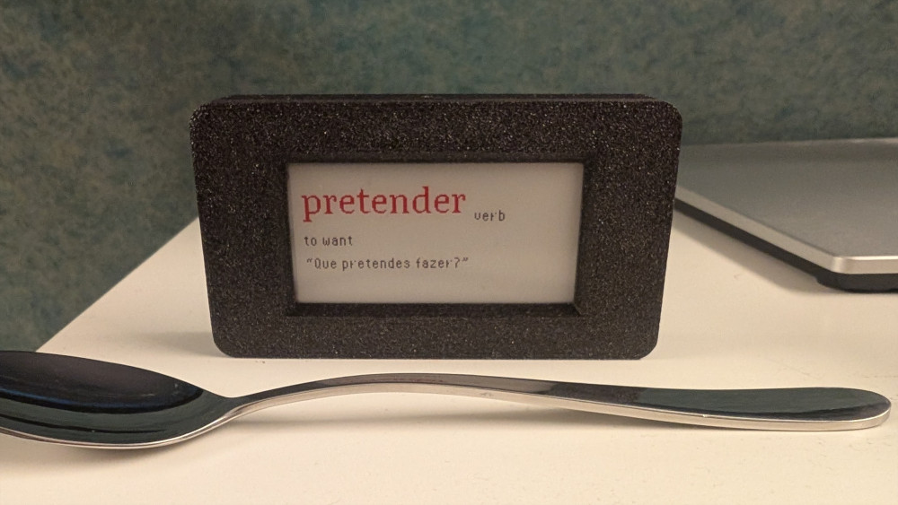

# Word of the day (PT)

Display a Portuguese word a day on an [Inkplate 2](https://soldered.com/products/inkplate-2).

Fetches definitions from [FreeDictionaryAPI](https://freedictionaryapi.com) (Wiktionary data) and example sentences from [Tatoeba](https://tatoeba.org) as a fallback.
Renders a 212×104 PNG served over HTTP, which the Inkplate fetches on a daily schedule.

<table>
  <tr>
    <td width="50%" align="center"></td>
    <td width="50%"></td>
  </tr>
  <tr>
    <td align="center">Rendered image</td>
    <td align="center">In production, with a teaspoon for scale</td>
  </tr>
</table>

## Prerequisites

- Python 3.14+
- [mise-en-place](https://mise.jdx.dev) (optional, for Python version and virtualenv management)
- Apache2 (for serving the output image)

## Setup

### Python environment

With mise:

```sh
mise install
pip install -r requirements.txt
```

Without mise, create and activate a virtualenv manually, then install dependencies:

```sh
python -m venv .venv
source .venv/bin/activate
pip install -r requirements.txt
```

### Word list

The word list (`data/wordlist.txt`) is sourced from [Linguee's top 201-800 Portuguese words](https://www.linguee.com/portuguese-english/topportuguese/201-1000.html), saved manually and trimmed to have one word/phrase per line.
Parse it once to generate `data/words.json`:

```sh
python render/parse_wordlist.py
```

### Apache2

To serve the image, you can use an Apache2 server on a RaspberryPi or a home lab PC.
To install and configure Apache2 on a RapsberryPi or a Debian/Ubuntu PC:

1. Run the following commands in the terminal:

   In the `chown` command, change `pi` to use your username.

   ```bash
   sudo apt update
   sudo apt install apache2 -y
   sudo chown pi:www-data /var/www/html
   sudo chmod 755 /var/www/html
   ```

## Running

To generate today's image and copy the generated file to the Apache2 directory:

1. In the project folder, run:

   ```sh
   python main.py
   ```

  This generates an image, saves it to `output/today.png` and moves it to `/var/www/html/today.png`.
  To use a different target directory, edit `SERVE_PNG` in `main.py`.

1. Check if you can see the image at `http://localhost/today.png` from the same PC, or change the URL to use your PC's IP.

The word used is added to `data/history.json` so it doesn't appear again.

To only generate a new image without copying it over, run `render/render.py`.

### Cron

Schedule daily generation and moving image at 00:01 local time:

```sh
1 0 * * * /path/to/word-of-the-day-inkplate2/.venv/bin/python /path/to/word-of-the-day-inkplate2/main.py 2>&1 | logger -t wordofday
```

To see this job's logs, run:

```sh
journalctl -t wordofday
```

## Inkplate configuration

Follow these steps if you're setting this up on an Inkplate 2 from Soldered:

1. Install and configure [Arduino IDE v2](https://www.arduino.cc/en/software/).
1. Follow the Soldered [quick start guide](https://docs.soldered.com/inkplate/2/quick-start-guide/) to configure Arduino IDE and upload an example.
1. In Arduino IDE, select **File > Open** and select `inkplate/inkplate.ino`.
1. Fill out the variables in the sketch with:
   - `WIFI_SSID` - your wi-fi name
   - `WIFI_PASSWORD` - your wi-fi password
   - `IMAGE_URL` - the path to the rendered image
   - `SLEEP_INTERVAL_US` - how often the board should download the image
1. Upload the sketch to your board.

## Overrides (optional)

Some words may have missing, incorrect, or Brazilian Portuguese example sentences.
Add manual substitutions to `data/overrides.json`:

```json
{
  "saudade": {
    "pos": "noun",
    "definition": "A deep emotional state of nostalgic longing for something absent.",
    "example": "Ela olhou o mar com saudade do filho."
  }
}
```

Any word present in `overrides.json` bypasses the API entirely. All three fields must be provided; `example` can be an empty string if no example is available.

```json
{
  "saudade": {
    "pos": "noun",
    "definition": "A deep emotional state of nostalgic longing for something absent.",
    "example": "Ela olhou o mar com saudade do filho."
  }
}
```

## Adapting this project

### For another language

The project has minimal language-specific hardcoding.
To adapt it:

1. Replace `data/wordlist.txt` with a word list for your target language, one word or phrase per line, and run `parse_wordlist.py`.
1. In `render/render.py`, update the two API language codes at the top of the file:
   - `API_DICT` uses an ISO 639-1 code (for example, `pt` for Portuguese).
     FreeDictionaryAPI's supported languages are listed in its [documentation](https://freedictionaryapi.com).
   - The Tatoeba (used as backup source for examples) call in `fetch_tatoeba_example()` uses an ISO 639-3 code (for example, `por` for Portuguese).
     Tatoeba's supported languages are listed on their [statistics page](https://tatoeba.org/en/stats/sentences_by_language).
1. If you need another font for your target script, the code uses two font types:

   - `FONT_ROMAN` (Literata, variable font) for the main word only.
   - `FONT_PIXEL` (Pixel Operator, static font) for the part of speech, definition, and example.

   Replace either path in `render/render.py` with a font that supports your target script.
   If you replace Literata with a static font, use `load_font()` instead of `load_variable_font()` when loading `font_word` in `render_png()`.

Note that FreeDictionaryAPI coverage varies significantly by language, and the Tatoeba minimum word length heuristic (`TATOEBA_MIN_CHARS`) was chosen for Portuguese.
You might want to adjust it for languages with different word length distributions.

## For another board or screen

The main changes needed are:

1. Update `WIDTH` and `HEIGHT` in `render/render.py` to match your screen's resolution.
1. In the Arduino sketch, update the `#ifndef` check at the top to match your board's identifier,
   and select the correct board in the Arduino IDE.
   Refer to the [Inkplate Arduino library](https://github.com/SolderedElectronics/Inkplate-Arduino-library) for supported boards and their identifiers.
1. If your screen has a different color depth, adjust the colors used in `render/render.py`.
   The Inkplate 2 supports black, white, and red, so any other color will not render correctly.

## License

This project is licensed under the MIT license.
See [LICENSE](./LICENSE).

The fonts used are Literata and PixelOperator.
Their licenses are in `render/fonts/licenses`.
